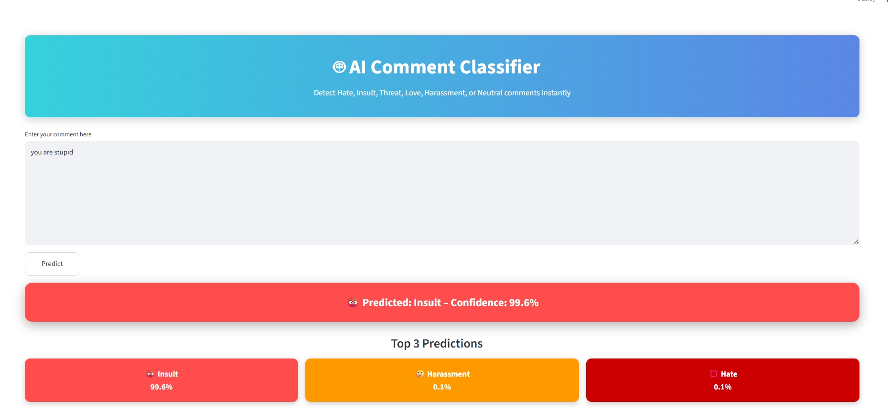
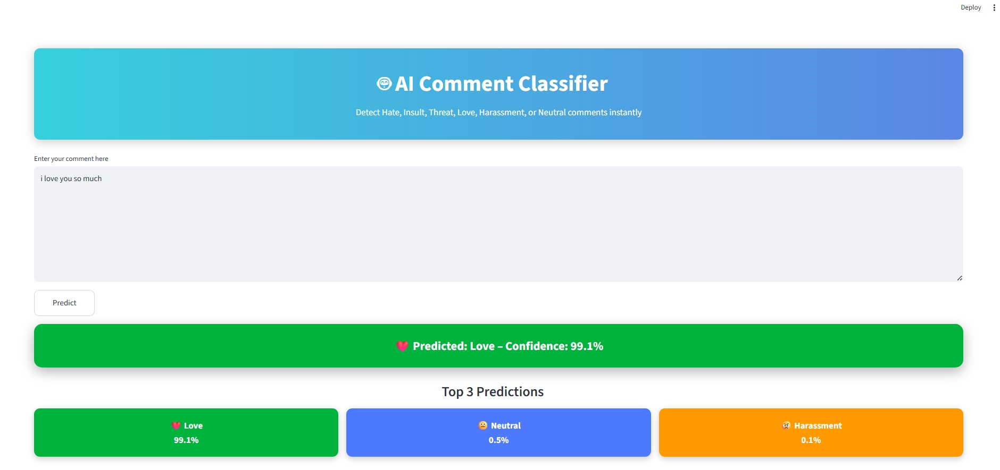
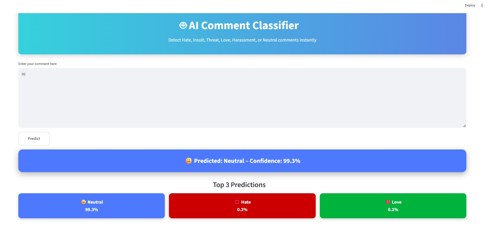
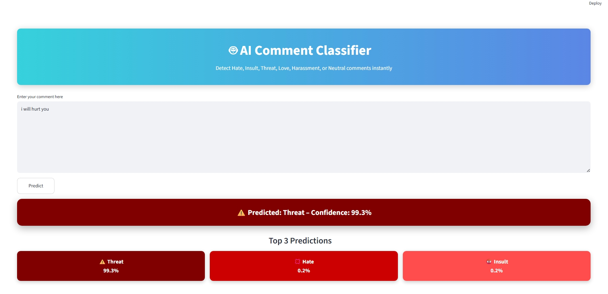

\# 🤖 AI Comment Classifier


A Machine Learning + NLP project that classifies user comments into:


\*\*Hate | Insult | Threat | Love | Harassment | Neutral\*\*


Built using TF-IDF and a calibrated Linear SVM, with a Streamlit web interface.


---


\## 🔍 Features


\- Real-time comment classification

\- Confidence scores for each class

\- Balanced dataset (960+ samples)

\- Classical ML with explainability

\- Streamlit-based UI demo


---


\## 🧠 Model Details


\- \*\*Text Processing:\*\* Tokenization, stopword removal, lemmatization

\- \*\*Vectorization:\*\* TF-IDF (1–2 grams)

\- \*\*Classifier:\*\* LinearSVC + CalibratedClassifierCV

\- \*\*Evaluation:\*\* Stratified train-validation split


---


\## 📁 Project Structure


AI-Comment-Classifier/

│── app.py # Streamlit app

│── train.py # Model training

│── generate\_data.py # Dataset augmentation

│── data/

│ ├── comments\_seed.csv

│ └── comments.csv

│── requirements.txt

│── .gitignore


---
---

## 📸 App Screenshots

### 🔹  Prediction1


### 🔹 Prediction2


### 🔹 Prediction3


### 🔹 Prediction4

----

\## 🚀 Run Locally


\### 1️⃣ Install dependencies

```bash

pip install -r requirements.txt


2️⃣ Train the model

python train.py


3️⃣ Run the app

streamlit run app.py


🧪 Example Predictions

Input	                 Prediction

hi	                    Neutral

i love you so much	     Love

you are stupid	        Insult

i will hurt you       	Threat

stop messaging me     	Harassment

📌 Notes

Model files are excluded from GitHub via .gitignore

Dataset is intentionally balanced to avoid bias

Designed as a learning + portfolio project


👤 Author

Srinath

